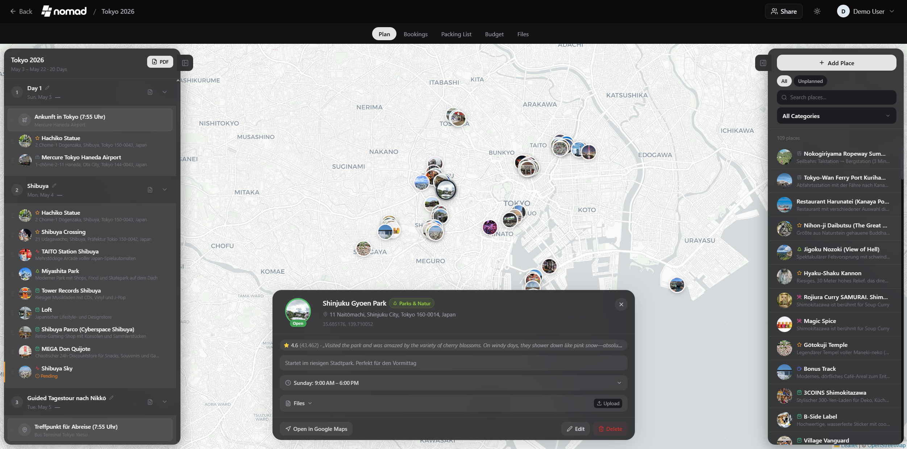

# TripNest

**Where every trip begins**

A self-hosted, real-time collaborative travel planner with interactive maps, AI trip planning, budgets, packing lists, and more.

**[Live Demo](https://24soul.ru)** — Try TripNest without installing.



## Features

- **AI Trip Planner** — Describe your trip in natural language, get a complete day-by-day itinerary with places on the map
- **Interactive Maps** — Leaflet maps with photo markers, clustering, route visualization
- **Real-Time Collaboration** — Plan together via WebSocket — changes appear instantly
- **Budget Tracking** — Category expenses, charts, per-person splitting, multi-currency
- **Packing Lists** — Categorized checklists with progress tracking
- **Reservations** — Track flights, hotels, restaurants with Find Flights and Find Hotel buttons
- **Telegram Bot** — AI planning and trip management via @TripNest_bot
- **PWA** — Install on iOS and Android from the browser
- **15+ Languages** — Full internationalization including Russian

## Quick Start

```bash
docker run -d -p 3000:3000 \
  -v ./data:/app/data \
  -v ./uploads:/app/uploads \
  -e ANTHROPIC_API_KEY=your_key \
  -e TELEGRAM_BOT_TOKEN=your_token \
  ghcr.io/yourusername/tripnest:latest
```

## Tech Stack

- **Backend**: Node.js 22 + Express + SQLite
- **Frontend**: React 18 + Vite + Tailwind CSS
- **AI**: Anthropic Claude API via Cloudflare Workers proxy
- **Real-Time**: WebSocket
- **Maps**: Leaflet + OpenStreetMap
- **PWA**: Vite PWA + Workbox
- **Reverse Proxy**: Caddy

## Environment Variables

| Variable | Description |
|---|---|
| `ANTHROPIC_API_KEY` | Anthropic API key for AI planning |
| `TELEGRAM_BOT_TOKEN` | Telegram bot token |
| `PUBLIC_APP_URL` | Your app URL (e.g. https://yourdomain.com) |
| `TELEGRAM_WEBHOOK_URL` | Webhook URL for Telegram bot |

## Built By

[AureStudio](https://www.aurestudio.ru/) — AI-first development studio

Based on [TREK](https://github.com/mauriceboe/TREK) (AGPL-3.0)

## License

AGPL-3.0
